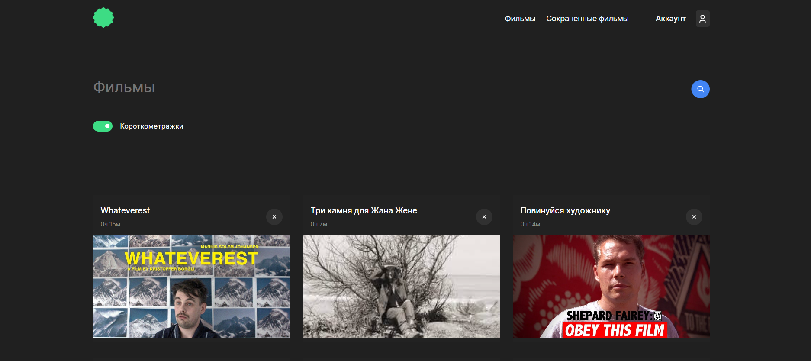

<h3 align="left">🎥 Проект: movies-explorer-frontend</h3>

<h3 align="left">🎞️ Содержание</h3>
<ul>
<li> Ссылки на сервер и домейны проекта </li>
<li> Введение </li>
<li> Реализованные функции и используемые технологии </li>
<li> Стек </li>
<li> Макет в Figma </li>
<li> Инструкция по запуску на локальной машине </li>

</ul>

<h3 align="left">🌐 Ссылки на сервер и домейны проекта:</h3>
Проект изначально размещался в Яндекс-облаке, затем был переведен на хостинг Vercel (в скобках указаны изначальные ссылки).

<ul>
<li>🗄️ IP сервера: динамический (бывший 158.160.40.254)</li>
<li>⚛️ Frontend часть:
<a href="https://movies-explorer-frontend-ruby.vercel.app" style="cursor: pointer">https://movies-explorer-frontend-ruby.vercel.app</a>
(ссылка на проет в Яндекс-облаке <a href="https://movies.grishkov.nomoredomains.club" style="cursor: pointer">https://movies.grishkov.nomoredomains.club</a>)
</li>
<li>⚙️ Backend часть:
<a href="https://movies-explorer-api-ten.vercel.app" style="cursor: pointer">https://movies-explorer-api-ten.vercel.app</a>
(ссылка на проет в Яндекс-облаке <a href="https://api.movies.grishkov.nomoredomains.icu" style="cursor: pointer">https://api.movies.grishkov.nomoredomains.icu</a>)
</li>
<li>✍️Репозиторий с Backend частью:
<a href="https://github.com/Andrey-Grishkov/movies-explorer-api" style="cursor: pointer">https://github.com/Andrey-Grishkov/movies-explorer-api</a>
</li>
</ul>

<h3 align="left">🎬️ Введение</h3>
Приложение для поиска фильмов, выполненное в рамках дипломного проекта Яндекс-Практикум с использованием React.
На главной странице приложения информация о проекте, разработчике и примененных технологиях.
Пользователь в приложении может проходить регистрацию и авторизацию,
менять данные введеные при регистрации, добавлять и удалять фильмы, которые отображается для данного пользователя 
на отдельной вкладке.


*Сохраненные фильмы*

<h3 align="left">👩🏻‍🚀 Реализованные функции и используемые технологии</h3>

* Регистрация, авторизация и выход пользователя из аккаунта
* Защита роутов от входа незарегистрированным пользователем 
  и защита от повторной авторизации уже авторизированного пользователя
* Редактирование имени и e-mail пользователя
* Валидация вводимых данных с использованием регулярных выражений во фронт части и библиотеки на бэк части.
* Поиск фильмов в базе данных по фильтру
* Добавление и удаление понравившихся карточек с фильмами
* Воспроизведение трейлера фильма при нажатии на карточку
* Главная страница с информацией о проекте, разработчике и примененных технологиях
* Страница 403
* Попапы с уведомлениями
* Адаптивная верстка с использованием Flexbox и Grid Layout
* Хуки useState и useEffect

<h3 align="left"> 🔨 Стек:</h3>

<p align="left">


</p>

<h3 align="left"> ссылка на макет в Figma:</h3>
<ul>
<li>
<a href="https://disk.yandex.ru/d/wOtuZSaDkSDGLw" style="cursor: pointer">https://disk.yandex.ru/d/wOtuZSaDkSDGLw</a>
</li>
</ul>

### 🚀 Инструкция по запуску на локальной машине:
* Установить [Node.js](https://nodejs.org/ru/)
* Клонировать репозиторий ``` git clone git@github.com:Andrey-Grishkov/movies-explorer-frontend.git```
* Установить зависимости ``` npm install ```
* Запустить приложение ``` npm run start ```
